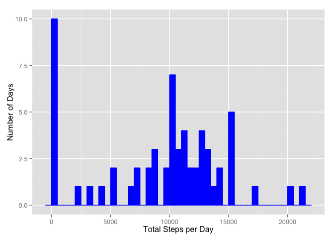
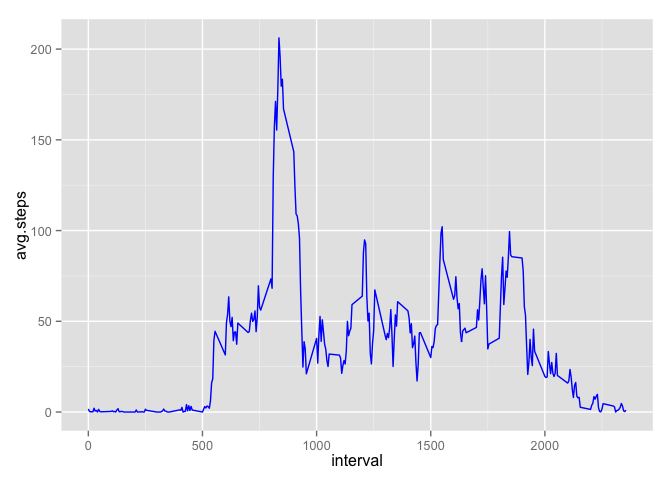
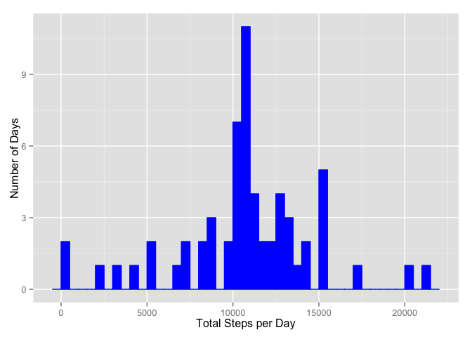
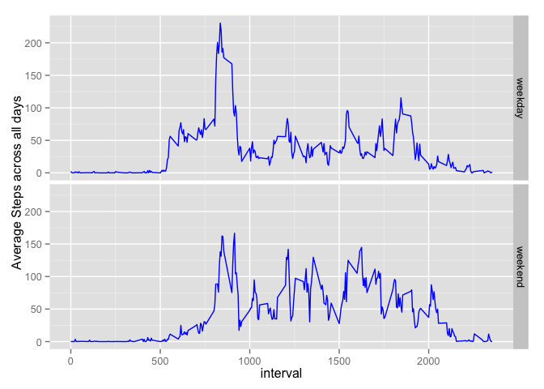

# Reproducible Research - Peer Assessment 1
Ashwin Yadav  
7 February 2016  

## Loading and Preprocessing the data

The code chunk below assumes that the file **activity.csv** is present in your working direction. The first step is to load the data from activity.csv, define the NA value and the data classes of each of the 3 variables.


```r
activity.table <- read.csv("activity.csv", na.strings = "NA", colClasses = c("numeric", "Date", "numeric"))
```
  

The summary characteristics of the loaded data can be verified with the *str()* function.


```r
str(activity.table)
```

```
## 'data.frame':	17568 obs. of  3 variables:
##  $ steps   : num  NA NA NA NA NA NA NA NA NA NA ...
##  $ date    : Date, format: "2012-10-01" "2012-10-01" ...
##  $ interval: num  0 5 10 15 20 25 30 35 40 45 ...
```
  
  
## What is mean total number of steps taken per day?
  
### Calculate the total number of steps taken per day
  
The total number of steps per day is arrived at by using **dplyr** functions *group_by* and *summarize*.


```r
library(dplyr)
```

```
## 
## Attaching package: 'dplyr'
## 
## The following objects are masked from 'package:stats':
## 
##     filter, lag
## 
## The following objects are masked from 'package:base':
## 
##     intersect, setdiff, setequal, union
```

```r
activity.bydate <- group_by(activity.table, date)
daily.summary <- summarise(activity.bydate, total.steps = sum(steps, na.rm = TRUE))
```
  
### Make a histogram of the total number of steps taken each day
  
We shall use ggplot2 to make the histogram. 
  

```r
library(ggplot2)
day_hist <- ggplot(daily.summary, aes(x = total.steps))
day_hist + geom_histogram(colour = "blue", fill = "blue", binwidth = 500) + xlab("Total Steps per Day") + ylab("Number of Days")
```

 
  
### Calculate and report the mean and median of the total number of steps taken per day
  
We will use the *daily_summary* data frame which contains the total number of steps by day to calculate the mean and median of the total number of steps taken per day.
  

```r
mean.spd <- mean(daily.summary$total.steps, na.rm = TRUE)
med.spd <- median(daily.summary$total.steps, na.rm = TRUE)
paste("Mean of total steps per day is", mean.spd)
```

```
## [1] "Mean of total steps per day is 9354.22950819672"
```

```r
paste("Median of total steps per day is", med.spd)
```

```
## [1] "Median of total steps per day is 10395"
```
  
  
## What is the average daily activity pattern?
  
### Make a time series plot of the 5-minute interval (x-axis) and the average number of steps taken, averaged across all days (y-axis)
  
We will need to first recast our summary data and create a summary by the **interval** across all days.


```r
activity.byinterval <- group_by(activity.table, interval)
interval.summary <- summarise(activity.byinterval, avg.steps = mean(steps, na.rm = TRUE))
```
  
Using the summarized data stored in *interval.summary*, we can now plot the line chart of average number of steps taken across all days by the 5 minute interval. 
  

```r
dailyactivity <- ggplot(interval.summary, aes(x = interval, y = avg.steps))
dailyactivity + geom_line(colour = "blue")
```

 
  
### Maximum number of steps in an interval
  
While finding the maximum number of steps (on average) in any interval can be evaluated with the *max* function, the corresponding interval can also be identified by subsetting the **interval** vector as shown below.


```r
maxstep.interval <- interval.summary$interval[interval.summary$avg.steps == max(interval.summary$avg.steps)]
paste("Highest number of steps is observed in the 5 minute interval starting", maxstep.interval, "with an average of", max(interval.summary$avg.steps), "steps across all days")
```

```
## [1] "Highest number of steps is observed in the 5 minute interval starting 835 with an average of 206.169811320755 steps across all days"
```
  
  
## Imputing Missing Values
  
### Calculate and report the total number of missing values
  
The missing values can be easily identified by the *is.na* function.


```r
missing.check <- is.na(activity.table$steps)
paste("The number of missing values in the dataset is", sum(missing.check))
```

```
## [1] "The number of missing values in the dataset is 2304"
```
  
### Imputing Strategy
  
For the purpose of this exercise, we will impute missing values by replacing the missing value with the average number of steps for the particular interval across all days. 
  
### Create a new dataset that is equal to the original dataset but with the missing data filled in.
  
We will create a new dataset **tidy.activity**
  

```r
tidy.activity <- activity.table
missing.index <- which(missing.check)
for (i in seq_along(missing.index)) {
  chkinterval <- tidy.activity[missing.index[i], 3]
  repsteps <- interval.summary$avg.steps[interval.summary$interval == chkinterval]
  tidy.activity[missing.index[i], 1] <- repsteps
}
```
  
### Histogram of the total number of steps taken each day
  

```r
# Calculate the total number of steps taken per day from the tidied dataset
library(dplyr)
tidyactivity.bydate <- group_by(tidy.activity, date)
tidydaily.summary <- summarise(tidyactivity.bydate, total.steps = sum(steps))

# Histogram of the total number of steps taken each day from the tidied dataset
library(ggplot2)
tidy.day_hist <- ggplot(tidydaily.summary, aes(x = total.steps))
tidy.day_hist + geom_histogram(colour = "blue", fill = "blue", binwidth = 500) + xlab("Total Steps per Day") + ylab("Number of Days")
```

 
  
### Recalculated mean and median on modified dataset with imputed values
  
We can recalculate the mean and median without using *na.rm* as there should be no more missing values. We will also look at the difference from the earlier calculated mean and median where we excluded missing values. 


```r
mean.tidyspd <- mean(tidydaily.summary$total.steps)
med.tidyspd <- median(tidydaily.summary$total.steps)
paste("Mean of total steps per day in the corrected dataset is", mean.tidyspd)
```

```
## [1] "Mean of total steps per day in the corrected dataset is 10766.1886792453"
```

```r
paste("Median of total steps per day in the corrected dataset is", med.tidyspd)
```

```
## [1] "Median of total steps per day in the corrected dataset is 10766.1886792453"
```

```r
meandif <- mean.tidyspd - mean.spd
meddif <- med.tidyspd - med.spd
paste("The mean moved by", meandif, "in the dataset with the imputed values inserted for missing values.")
```

```
## [1] "The mean moved by 1411.95917104856 in the dataset with the imputed values inserted for missing values."
```

```r
paste("The median moved by", meddif, "in the dataset with the imputed values inserted for missing values.")
```

```
## [1] "The median moved by 371.188679245282 in the dataset with the imputed values inserted for missing values."
```
  
  
## Differences in activity pattern between weekdays and weekends
  
### Create a new factor variable in the dataset with two levels ??? ???weekday??? and ???weekend??? indicating whether a given date is a weekday or weekend day.
  
This is accomplished by usign the *weekdays* function. 


```r
dayofweek <- weekdays(tidy.activity$date, abbreviate = TRUE)
weekday <- function(x) {
  if (x == "Sat" | x == "Sun") {
    x <- "weekend"
  } else {
    x <- "weekday"
  }
}
dayofweek <- sapply(dayofweek, weekday)
tidy.activity$day <- as.factor(dayofweek)
```
  
### Panel plot of average number of steps taken in each interval across all days and classified by weekdays and weekends
  
We will construct these plots on the reconstructed data with imputed missing values. For the sake of consistency, we will continue to use *ggplot2* for the actual plotting of the panels.
  

```r
new.activity.byinterval <- group_by(tidy.activity, interval, day)
new.interval.summary <- summarise(new.activity.byinterval, avg.steps = mean(steps))
qplot(x = interval, y = avg.steps, data = new.interval.summary, color = I("blue"), facets = day ~., geom = "line", ylab = "Average Steps across all days")
```

 


  
